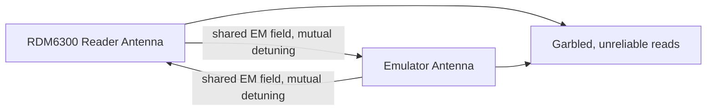
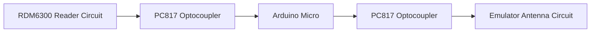


+ [x] Read 125kHz tags
- [x] Emulate 125kHz tags
- [x] Save tag data in memory
- [ ] Bruteforce 125kHz readers
- [ ] Manual mode
- [ ] Write to magic tags

## The $5-a-tag problem

My building rolled out a brand new access controller, and with it came a delightful new policy: every extra tag for a guest, a partner, a dog sitter, now costs money. I get the security upgrade. I do not love paying a toll to use my own front door. So I went looking for exactly what kind of security that fee is actually buying, for educational purposes, of course.

## First contact: assuming NFC, getting nothing

First instinct, tap the tag against my phone. Every smartphone since the early 2010s reads NFC, I still remember my old Xperia V being sold on that exact feature. I fired up NFC Tool on a rooted Nethunter build and got nothing. Tapped again. Nothing. By the fifth attempt I was basically polishing a keychain against my screen, feeding my ADHD one fruitless tap at a time instead of stepping back and actually thinking.

## Recon: two flavors of "NFC"

Turns out the thing everyone calls "NFC" is really two unrelated technologies sharing one buzzword.

| | 13.56MHz | 125kHz |
|---|---|---|
| Frequency class | High | Low |
| Writable | Yes | No (stock chip) |
| Data flow | Two way | One way |
| Storage | Up to 4KB | 64 bits |
| Encryption | Possible | None |
| Phone compatible | Yes | No |

People call the 13.56MHz cards "Mifare" as a catch-all, but Mifare is just one chip family among many (Ntag, Slix, ST25, and others). The cheap low frequency side usually runs on TK4100 or EM4100 chips, neither writable by design. There's a writable variant too, the T5577, sold as "magic tags."

My tag had a 10 digit number printed on it and ignored my phone completely. That put it cleanly in the 125kHz camp, and that mismatch between "this should just work" and "this does nothing" is exactly the kind of itch I can't leave alone.

## Two hypotheses, one cheap toolkit

Time to put money where the curiosity was. Shopping list: an RDM6300 reader module, a handheld 125kHz cloner, and a 0.91" i2c OLED for later.



Two hypotheses to test:

1. Clone the tag with the handheld cloner: if it takes onto a T5577 blank, the original is a writable T5577, if it fails, the original is a stock EM4100/TK4100.
2. Build a basic reader around the RDM6300 and see what comes back over serial.

The clone attempt failed flat, confirming stock EM4100 family, not a writable T5577. The RDM6300 reader worked first try and handed me my first real look at the data.

## Reading the bits: what's actually on a 125kHz tag

This is the part where the spec sheet stops being abstract and starts being something I can actually hold accountable. Cross referencing the EM4100 datasheet against what the RDM6300 was outputting, a tag holds exactly 64 bits:

- 9 header bits (a fixed run of 1s, basically a wake up trigger)
- 40 data bits, a version/manufacturer byte plus a 32 bit tag ID
- 10 row parity bits, one per nibble
- 4 column parity bits
- 1 closing bit

Parity here just means counting the 1s in a nibble. If the count is odd, the parity bit gets set to balance it out, if even, it stays clear (EM410x uses this even parity convention specifically).

My tag's printed number was 0009622573. The RDM6300 read it back as hex, 49 for the version byte, 0092D42D for the tag itself. Convert 0092D42D back to decimal and you land exactly on 9622573, matching the printed number once you account for leading zeros. The whole path:

**Printed decimal serial → hex → binary, version byte tacked on in front.**

Run that hex string through the header/data/parity layout above and it maps perfectly onto a 64 bit EM4100 frame. Two things fall out of this, and the second one is the one that kept me thinking about it for days:

- The version byte isn't printed anywhere on the tag, you cannot guess it by looking.
- The entire identity is a 10 hex digit number, which means a hard floor and ceiling, 00 00000000 to FF FFFFFFFF. A bounded keyspace, in theory, is a keyspace you can exhaust. I'll come back to exactly how impractical that theory turns out to be.

Worth being precise here: that's 10 hex digits, 2^40 values, not the same as the 10 digit decimal serial printed on the tag. The printed number is only the 32 bit tag portion rendered in decimal, and its real ceiling is 4,294,967,295, the binary limit, not 9,999,999,999, the decimal one. Same order of magnitude, different number, and it matters once you start multiplying by transmission time.

## The pivot: building NFCat instead of buying a Flipper

A Flipper Zero or Proxmark does all of this out of the box, but buying one felt like admitting defeat before I'd even tried, on top of being expensive and frequently out of stock. I wanted something I built myself, cheap, and fully open source, so the next person doesn't have to start from zero either.

Target feature set:

- Emulate any read tag
- Read tags and extract version + tag hex
- Save reads into memory slots
- Replay a saved slot
- Bruteforce a tag space
- Manual entry with version bruteforce
- Write to T5577 magic tags

Hardware ended up being an Arduino Micro pulled from a drawer, the RDM6300 doing the reading, and a 0.91" OLED for the interface. Reading was basically solved already, the RDM6300 handles that natively. The real fight was emulation.



## Emulation: turning a chip's trick into code

An EM4100 chip doesn't transmit in the radio sense. It just toggles a tuned LC coil between two states and lets the reader's own field do the rest. Recreate that toggle with anything that can pull a coil to ground fast enough, and the reader has no way to tell a real chip from a fake one.

I drove the coil with a 2N3904 sitting between the microcontroller and the tank circuit, its base fed through a 10K resistor straight off a digital pin. Pin goes high, the transistor saturates and yanks the coil to ground, killing the field. Pin goes low, the tank rings free. That on and off dance, timed at the right cadence, is the entire trick. Ten cents of silicon doing the job of a chip that costs more to source than to clone.

I reused the RDM6300's own antenna, roughly 860uH, and built the resonant tank around it instead of calculating fresh LC values from scratch. The data itself goes out Manchester encoded: at 125kHz, one bit period is 512 microseconds, not milliseconds, that distinction gets expensive fast once you start multiplying by billions, split into two 256 microsecond halves, a 1 becomes high then low, a 0 becomes low then high.

This is also where bruteforce stops being a hardware problem and becomes a software one. Once the chip can emit an arbitrary 64 bit frame, sweeping through tag IDs is just incrementing a counter and re-encoding. The full Manchester encoder, parity calculator, and the bruteforce loop are in the NFCat repo, linked further down, no point pasting 100 lines of Arduino here.

## What failed: cross-talk between reader and emulator

First real test on the bench, both circuits sharing space, and instead of clean square waves I got noise soup. Each antenna was detuning the other every time it switched state, so neither side could get a clean read off the other.


If two LC-tuned antennas share bench space, they will detune each other the moment either one switches state. Noisy, inconsistent reads on a build like this almost always trace back to this, before you go chasing firmware bugs.


## The fix: optocouplers

I air-gapped the two circuits with PC817 optocouplers instead of reaching for transistors here too. Transistors would've worked, but the optocouplers gave cleaner electrical separation and I had a stack of them sitting on the shelf doing nothing. Safety over cleverness.



## The first green light

Cross-talk gone, I walked the emulator up to the actual building reader and just like that, the LED flipped green. I stood there for a second not quite believing it. A roll of magnet wire, a ten cent transistor, and a microcontroller had just convinced production access hardware I was a registered tag.

## Building the interface nobody asked for

I'm not a front-end person and it shows. NFCat runs on two buttons, three if you count the Arduino's hardware reset, which I use as an unofficial "back to main menu" because it is genuinely easier to reset the AT328P than write proper back-navigation.

- Short press left/right: navigate
- Long press left: back / cancel
- Long press right: enter / validate

Menu tree:



- Read
  - Save
  - Emulate
- Credit

## Where NFCat stands

Reading, emulating, and saving slots all work and have been tested against the real reader. Manual entry and writing to T5577 magic tags are designed but not yet built. Bruteforce is designed too, and deliberately not built, more on that below. Full schematics and code are up on GitHub under MIT, fork it.



## Why I'm not building the bruteforcer

Bruteforce sits on that checklist for a reason, and it's also the one feature I keep not finishing. That's not laziness, I did the math, and the math talked me out of it.

The full identity space is 40 bits, version byte plus tag ID, which is 2^40 possible values, just over 1.0995 trillion combinations. Each candidate has to go out as a full 64 bit Manchester frame at 512 microseconds per bit, roughly 32.8 milliseconds of pure radio time, and a reliable bruteforce loop sends every candidate at least twice to survive a missed read, so call it 65 milliseconds minimum per attempt before the reader has even processed anything. Round the full cycle generously to 100 milliseconds.

1.0995 trillion attempts at 100 milliseconds each is about 1.0995e11 seconds, which works out to roughly 3,487 years. Even with a generous assumption, that the building standardizes on one fixed version byte across all its tags so I only need to sweep the 32 bit tag portion, that's 2^32, about 4.29 billion combinations, still around 13.6 years of continuous, uninterrupted attempts.

And uninterrupted is doing a lot of work in that sentence. A real door controller logs every failed read. Stand at an entrance cycling IDs for a single afternoon and you've generated thousands of denied access events in someone's security log, long before covering a meaningful fraction of the keyspace. The bottleneck isn't clever encoding or fast hardware, it's the math itself, and no amount of soldering fixes that.


Bottom line: unknown version byte, full 40-bit space, ~3,487 years to exhaust at a generous 100ms per attempt. Known/fixed version byte, 32-bit tag space only, ~13.6 years. Neither is a weekend project against a live reader.


So bruteforce stays unchecked on purpose. Not because it can't be built, the loop itself is maybe twenty lines of code, but because shipping it would hand someone a feature that looks powerful on a list and is actually theater against any real production reader. I'd rather publish something honest about its limits than something that reads impressively and does nothing useful in the field.

## Takeaways

- "NFC" on a keychain tag almost never means smartphone-compatible NFC, check the frequency family first.
- EM410x's entire identity is a 10 hex digit number with a known floor and ceiling, exactly the kind of fact that should make any access control admin nervous about relying on tag ID alone.
- A single transistor and a 10K resistor are enough to fake the chip's own trick, the reader can't tell silicon apart, only timing matters.
- Shared antennas between a reader and an emulator will detune each other, isolate them.
- A bounded keyspace sounds bruteforceable right up until you multiply it by real transmission time, then it's measured in centuries, not afternoons.
- A 10 digit decimal serial is not automatically a 10 billion value keyspace, the binary ceiling underneath is usually lower than the decimal digit count suggests.
- A $15 reader module and a spare Arduino can replicate what a $200 commercial pentest tool does, just with more soldering and less polish.
